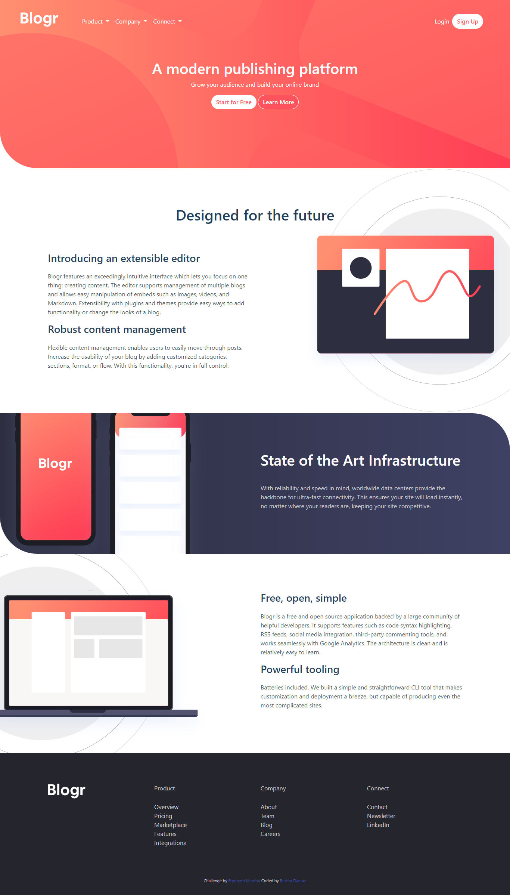

# Frontend Mentor - Blogr landing page solution

This is a solution to the [Blogr landing page challenge on Frontend Mentor](https://www.frontendmentor.io/challenges/blogr-landing-page-EX2RLAApP). Frontend Mentor challenges help you improve your coding skills by building realistic projects. 

## Table of contents

- [Overview](#overview)
  - [The challenge](#the-challenge)
  - [Screenshot](#screenshot)
  - [Links](#links)
- [My process](#my-process)
  - [Built with](#built-with)
  - [What I learned](#what-i-learned)
- [Author](#author)

## Overview

### The challenge

Users should be able to:

- View the optimal layout for the site depending on their device's screen size
- See hover states for all interactive elements on the page

### Screenshot



### Links

- Solution URL: [solution URL](https://www.frontendmentor.io/solutions/html-css-bootstrap-NltRfy2BG)
- Live Site URL: [live site URL](https://bushrada.github.io/blogrLandingPage/)

## My process

### Built with

- HTMLs
- CSS

### What I learned

```css
.proud-of-this-css {
  background-image: url(../images/illustration-phones.svg), linear-gradient(to right ,hsl(237, 17%, 21%),hsl(237, 23%, 32%) );
  background-position-x: 120%;
  background-position-y: center;
  background-size: 50%;
  background-repeat: no-repeat;
}
```

## Author

- Website - [Bushra Daoud](https://bushrada.github.io/)
- Frontend Mentor - [@BushraDa](https://www.frontendmentor.io/profile/BushraDa)
